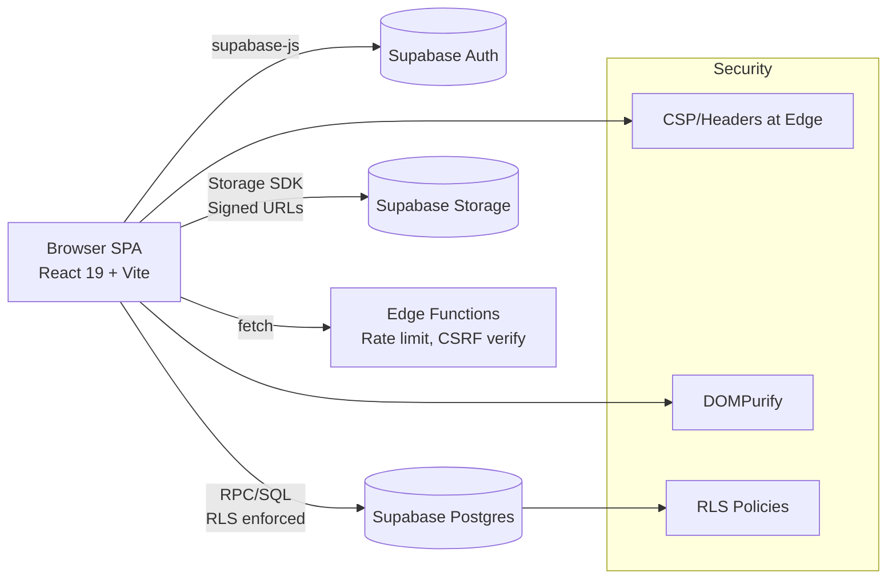

# WebSecurity — Full‑Stack OWASP Security Application (Supabase)

> Production‑ready template that demonstrates OWASP Top‑10 controls with Supabase Auth, strict RLS, CSP, input sanitization, and security monitoring.

## TL;DR

* **Frontend:** React 19 + Vite + React Router + Context
* **Backend:** Supabase (Postgres, Auth, Storage, Edge Functions)
* **Auth:** Email/password, Email OTP, Google OAuth, session sync
* **Data Security:** Row‑Level Security (RLS) with owner/role policies
* **AppSec:** XSS hardening (DOMPurify), CSP, rate limiting, CSRF (only if cookies used), secure headers at edge
* **Monitoring:** Supabase logs + optional Sentry; ZAP baseline in CI


## 1) Features

### 1.1 Authentication (Supabase‑Powered)

* Email/password with strength gate and server‑enforced policies
* Email verification & OTP flows
* Google OAuth via Supabase Provider
* Session management with `onAuthStateChange`
* Profile sync table with RLS (owner‑only reads/writes)

### 1.2 Security Controls

* **OWASP Coverage:** A01…A10 mapped (see §11)
* **XSS Protection:** DOMPurify for any untrusted HTML; React escapes by default
* **CSP:** Strict default‑src 'self'; allowlists for Supabase domains
* **CSRF:** *Only required for cookie‑based auth.* With Authorization header JWT, CSRF risk is minimal. Optional double‑submit token shown
* **Rate Limiting:** Supabase Edge Function example using Deno KV/Redis
* **RLS & SQLi:** Parameterized queries via Supabase client; RLS blocks cross‑tenant access
* **Secure Storage:** Private buckets with signed URLs
* **Secret Hygiene:** Environment scoping with Vite `VITE_` prefix; no secrets in code

### 1.3 UI/UX

* Responsive, accessible forms and navigation
* Protected routes via HOC/Wrapper + context
* Clear error messages without leaking internals

---

## 2) Architecture



**Model:** SPA talks directly to Supabase. No custom server needed. If you adopt cookie‑based auth later, put headers, CSRF, and rate limiting at the edge or a tiny BFF.

---

## 3) Project Structure

```
src/
  components/
    Home.jsx
    Login.jsx
    Navbar.jsx
    ProtectedRoute.jsx
    Register.jsx
  context/
    AuthContext.jsx
  lib/
    supabaseClient.js
    security/csp.js            # hosting examples
    security/domPurify.js      # sanitizer wrapper
  styles/
    global.css
    Home.css
    Login.css
    Navbar.css
    Register.css
  App.jsx
  main.jsx
index.css
```

---

## 4) Setup

### 4.1 Prerequisites

* Node 18+
* Supabase project (free tier OK)

### 4.2 Supabase Config

1. Create project → copy **Project URL** and **anon key**
2. Enable **Email** and **Google** providers (Authentication → Providers)
3. Create **profiles** table (see §6) and enable RLS

### 4.3 Environment

Create `.env`:

```
VITE_SUPABASE_URL=https://YOUR-PROJECT.supabase.co
VITE_SUPABASE_ANON_KEY=YOUR_ANON_KEY
```

### 4.4 Run

```bash
npm install
npm run dev
# open http://localhost:5173
```

---

## 5) Auth Integration (supabase-js)

**`src/lib/supabaseClient.js`**

```js
import { createClient } from '@supabase/supabase-js'
export const supabase = createClient(
  import.meta.env.VITE_SUPABASE_URL,
  import.meta.env.VITE_SUPABASE_ANON_KEY,
  { auth: { persistSession: true, autoRefreshToken: true } }
)
```

**Register**

```js
await supabase.auth.signUp({
  email, password,
  options: { data: { username }, emailRedirectTo: window.location.origin }
})
```

**Login**

```js
const { data, error } = await supabase.auth.signInWithPassword({ email, password })
```

**Google OAuth**

```js
await supabase.auth.signInWithOAuth({ provider: 'google', options: { redirectTo: window.location.origin } })
```

**Session Listener**

```js
supabase.auth.onAuthStateChange((_event, session) => setUser(session?.user ?? null))
```

---

## 6) Database + RLS

**profiles table**

```sql
create table if not exists public.profiles (
  id uuid primary key references auth.users on delete cascade,
  username text unique,
  full_name text,
  created_at timestamp with time zone default now()
);

alter table public.profiles enable row level security;

-- Owner can select/update own row
create policy "profiles_owner_select" on public.profiles
for select using (auth.uid() = id);

create policy "profiles_owner_update" on public.profiles
for update using (auth.uid() = id);

-- Insert only self
create policy "profiles_self_insert" on public.profiles
for insert with check (auth.uid() = id);
```

**Auto‑provision profile** (optional trigger)

```sql
create or replace function public.handle_new_user()
returns trigger as $$
begin
  insert into public.profiles (id, username)
  values (new.id, split_part(new.email, '@', 1));
  return new;
end;
$$ language plpgsql security definer;

create trigger on_auth_user_created
  after insert on auth.users
  for each row execute procedure public.handle_new_user();
```

---

## 7) Protected Routes (React Router)

**`ProtectedRoute.jsx`**

```jsx
import { useAuth } from '../context/AuthContext'
import { Navigate } from 'react-router-dom'

export default function ProtectedRoute({ children }) {
  const { user, loading } = useAuth()
  if (loading) return null
  return user ? children : <Navigate to="/login" replace />
}
```

---

## 8) Input Sanitization (XSS)

**Wrapper**

```js
import DOMPurify from 'dompurify'
export const sanitize = (dirty) => DOMPurify.sanitize(dirty, { USE_PROFILES: { html: true } })
```

**Usage**

```jsx
<div dangerouslySetInnerHTML={{ __html: sanitize(userContent) }} />
```

---

## 9) CSRF Strategy

* If you **use Authorization header JWT** from `supabase-js` (default), **CSRF is not applicable** because cookies are not sent automatically by the browser.
* If you switch to **cookie‑based auth** (BFF/edge), implement **double‑submit token**:

  * Set `csrf_token` cookie (SameSite=Strict, HttpOnly=false) and send the same value in a custom header `x-csrf-token`.
  * Server verifies equality for state‑changing requests.

**Edge example (pseudo‑Deno)**

```ts
const token = req.headers.get('x-csrf-token')
const cookie = cookies.get('csrf_token')
if (req.method !== 'GET' && token !== cookie) return new Response('Forbidden', { status: 403 })
```

---

## 10) Content Security Policy (CSP)

Set at your host (Netlify `_headers`, Vercel, Cloudflare):

```
/*
  Content-Security-Policy: default-src 'self'; connect-src 'self' https://*.supabase.co; img-src 'self' data: https://*.supabase.co; style-src 'self' 'unsafe-inline'; script-src 'self'; frame-ancestors 'none'; base-uri 'self'; form-action 'self'
  Referrer-Policy: no-referrer
  X-Content-Type-Options: nosniff
  X-Frame-Options: DENY
  Permissions-Policy: camera=(), microphone=(), geolocation=()
```

Adjust if you embed third‑party assets.

---

## 11) OWASP Mapping (ASVS Lite)

| Risk                       | Mitigation                                                |
| -------------------------- | --------------------------------------------------------- |
| A01 Broken Access Control  | RLS owner policies; ProtectedRoute; no client‑trust       |
| A02 Cryptographic Failures | TLS only; Supabase managed; no plaintext secrets          |
| A03 Injection              | Parameterized calls via supabase‑js; no string SQL        |
| A04 Insecure Design        | Minimal attack surface; BFF optional; threat model in §16 |
| A05 Security Misconfig     | CSP, headers, environment separation                      |
| A06 Vulnerable Components  | `npm audit` + Dependabot; lockfile in CI                  |
| A07 Auth/Z Failures        | Supabase sessions, email verification, OAuth              |
| A08 Data Integrity         | Signed URLs; least‑privilege RLS                          |
| A09 Logging/Monitoring     | Supabase logs; optional Sentry breadcrumbs                |
| A10 SSRF                   | SPA only; no server‑side fetch exposed                    |

---

## 12) Rate Limiting (Edge Function)

**`functions/ratelimit/index.ts`** (concept)

```ts
// Use Deno KV or Upstash Redis
const key = `${clientIp}:${route}`
const hits = await kv.get(key) || 0
if (hits > 60) return new Response('Too Many Requests', { status: 429 })
await kv.set(key, hits + 1, { expireIn: 60 })
```

Attach before sensitive endpoints like `/register`.

---

## 13) Storage Security

* Private buckets by default
* Generate signed URLs client‑side for limited time

```js
const { data } = await supabase.storage.from('private').createSignedUrl(path, 60)
```

---

## 14) Linting + Dependency Policy

* ESLint included; add `eslint-plugin-security`
* Pin versions; run `npm audit --production`
* CI blocks on critical vulns

---

## 15) CI/CD Security

**GitHub Actions: ZAP Baseline**

```yaml
name: security-scan
on: [push]
jobs:
  zap:
    runs-on: ubuntu-latest
    steps:
      - uses: actions/checkout@v4
      - uses: zaproxy/action-baseline@v0.11.0
        with:
          target: 'https://preview.yourapp.com'
```

Add build, unit tests, and lint steps.

---

## 16) Threat Model (STRIDE)

| Threat          | Example             | Control                           |
| --------------- | ------------------- | --------------------------------- |
| Spoofing        | Fake sessions       | Supabase JWT + verification       |
| Tampering       | Cross‑tenant writes | RLS owner checks                  |
| Repudiation     | Missing audit       | Supabase logs                     |
| Info Disclosure | Public bucket       | Private buckets + signed URLs     |
| DoS             | Registration spam   | Rate limiting + CAPTCHA if needed |
| Elevation       | IDOR                | RLS, never trust client IDs       |

---

## 17) Testing Checklist

* Auth: register/login/logout, email verify, OAuth
* RLS: try reading/updating other users’ profiles
* XSS: attempt `` in any user field
* CSP: check console for blocked origins; tighten allowlists
* Rate Limit: exceed thresholds; expect 429
* ZAP: baseline scan clean

---

## 18) Developer Notes

* Keep logic in React; avoid server where possible
* If you adopt a BFF: add Helmet, cookie flags, CSRF tokens, and reverse proxy only to Supabase

---

## 19) Roadmap

* Password reset + magic links
* Remember‑me and reauth prompts
* Profile CRUD with avatar upload (signed URLs)
* Dark mode and i18n
* Sentry monitoring + robust error boundaries

---

## 20) License

Add your chosen license.
